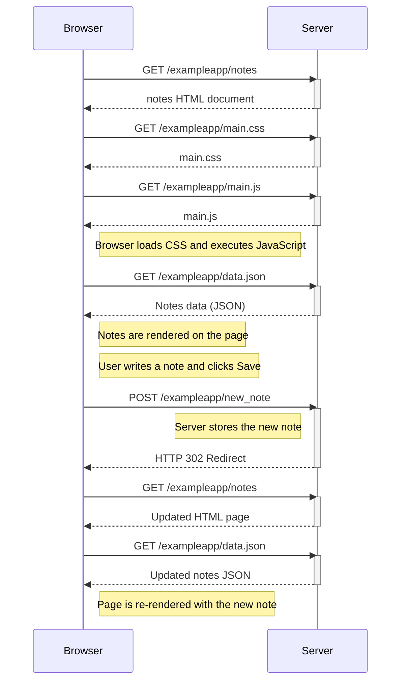

what happens when we go to
https://studies.cs.helsinki.fi/exampleapp/notes

1. we get notes html document which then calls main.css main.js
   2.renders main.css
   3.renders main.js
2. main .js fetches data from data.json to render it on the website
3. when we enter the new note and click submit the data goes to /exampleapp/new_note by POST method

6.then a new_note is stored on the sever which has the new note we created and the website is re rendered

