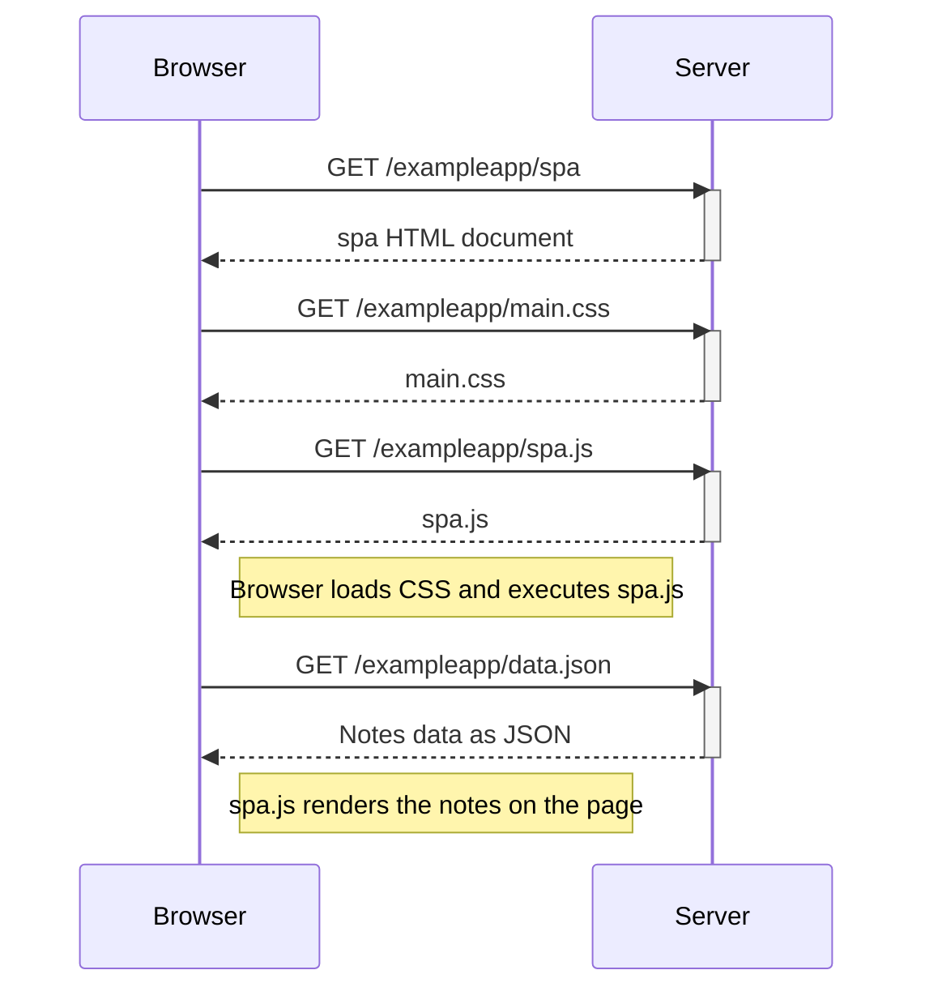

Create a diagram depicting the situation where the user goes to the single-page app version of the notes app at https://studies.cs.helsinki.fi/exampleapp/spa.

1.browser send get equest to spa html document
2.spa html document renders and then calls main.css and spa.js
3.spa.js then calls data.json which contains the contents and date of the notes created
4.then the notes are rendered

