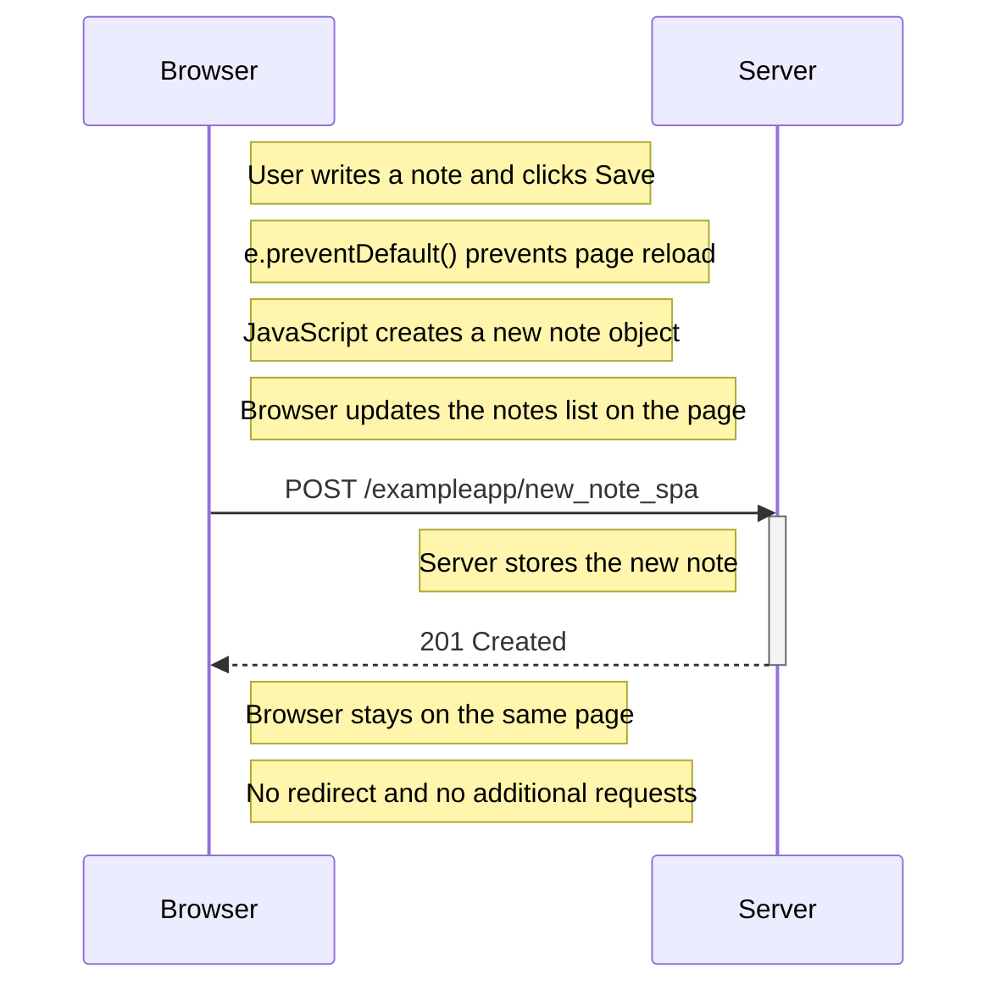

0.6: New note in Single page app diagram
Create a diagram depicting the situation where the user creates a new note using the single-page version of the app.

1.when we create a new note browser sends a POST request to the new_note_spa which contains the contents and date of the notes 2. the server responds with 201 created
3.This time the server does not ask for a redirect, the browser stays on the same page, and it sends no further HTTP requests due to e.preventDefault() which avoids the deafult action of the browser
4.then the eventhandler creates the new note and sends it to the server which then renders it

